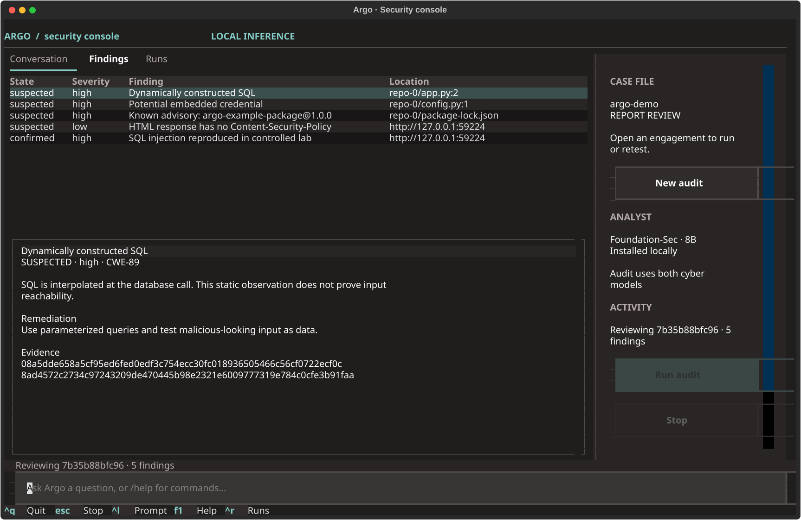

# Argo

A local cybersecurity agent for repository audits and authorized web checks, with reproducible evidence.

Argo inspects selected source code and dependencies, runs isolated scanners, validates a limited set of web findings, and asks specialized local cybersecurity models to review the evidence. Models cannot run shell commands, expand the target scope, or mark their own hypotheses confirmed.

## Install

Requirements: Python 3.12+, `uv`, Docker, and native Ollama. Start Docker and Ollama before installing scanner images and models.

```bash
uv sync --frozen --dev
uv run python scripts/install_scanners.py
uv run python scripts/install_models.py
uv run argo doctor
```

Install the terminal command with the same dependency versions:

```bash
uv export --frozen --no-dev --no-emit-project --format requirements-txt --output-file /tmp/argo-constraints.txt >/dev/null
uv tool install --editable . --python 3.12 --constraints /tmp/argo-constraints.txt
```

The model installer downloads checksum-verified GGUF artifacts from pinned Hugging Face revisions and creates two local Ollama aliases:

| Alias | Model | Role |
| --- | --- | --- |
| `argo-foundation-sec:8b` | Foundation-Sec-8B-Reasoning, official Q4_K_M conversion | Security analysis and evidence review |
| `argo-vulnllm:7b` | VulnLLM-R-7B, community Q4_K_M conversion | Source vulnerability review |

The models load sequentially and unload after generation. Cloud model aliases are rejected. Exact weights, revisions, hashes, and provenance are in [models.lock.json](config/models.lock.json). Installation does not establish model accuracy on every language or vulnerability class.

## Terminal interface

Run `argo` to open the TUI, or `argo tui engagement.json` to load an existing case. All CLI subcommands remain available for scripts. Without a terminal, `argo` prints help.

The interface uses [Textual](https://github.com/Textualize/textual) under MIT. It shares Argo's Python controller and evidence store. The design draws on a terminal-first workflow; it is not a fork of Claude Code, Codex CLI, or OpenCode. [Toad](https://github.com/batrachianai/toad) is an alternative ACP frontend, and a possible future integration.



| Interaction | Command |
| --- | --- |
| Create an engagement with a form | `/new` |
| Open an engagement | `/open /absolute/path/to/engagement.json` |
| Review targets, actions, and limits | `/scope` |
| Record authorization for the displayed contract | `/authorize` |
| Run the audit with both cyber models and Docker scanners | `/run` |
| Run the isolated vulnerable/fixed lab | `/demo` |
| Inspect findings and select one as chat context | `/findings` |
| Open a selected finding's first evidence record | `/evidence` |
| Open a specific evidence record | `/evidence EVIDENCE_ID` |
| Review saved runs | `/runs`, then select a row and press Enter |
| Load a saved report | `/resume RUN_ID` |
| Read the full report | `/report` |
| Retest the loaded engagement against the selected run | `/retest` |
| Select the chat model | `/model foundation` or `/model vulnllm` |
| Cancel active work | Escape or `/stop` |

Type a question to discuss the current case or selected finding. Evidence is integrity-checked and redacted before entering chat context. Chat replies are advisory; only explicit operator commands start audits. Source text cannot invoke tools. Models differ in language support; Foundation-Sec's upstream model card lists English as its supported language.

Tab completes commands, up/down recall prompts, Ctrl+L focuses the input, Ctrl+R opens saved runs, F1 lists commands, and Ctrl+Q stops active work before closing. The sidebar hides on narrow terminals. Reports persist locally; conversation history stays in memory and is cleared when switching cases or runs. `/resume` reopens a report, not an interrupted scan.

Use `/run --no-model` or `/demo --no-model` for explicit scanner-only operation. Add `--no-scanners` to use just the bundled static checks. `/doctor` reports service readiness. Full chat and audit validation details are recorded in [validation.md](docs/validation.md).

## Run the isolated demo from the CLI

```bash
uv run argo demo --scanners
```

The demo creates a temporary repository, synthetic advisory data, and vulnerable/fixed SQLite HTTP fixtures on loopback. It checks that only the vulnerable HTTP fixture produces a confirmed SQL injection result. Fixture servers and source snapshots are removed after the run; reports remain under `~/.argo/runs/`.

For a deterministic scanner-only test, explicitly use `--no-model`. A normal run requires its selected cyber models to be installed; there is no silent general-model or cloud fallback.

## Audit an authorized project

```bash
uv run argo init engagement.json --id my-audit --repo /absolute/path/to/project
uv run argo plan engagement.json
uv run argo authorize engagement.json --operator your-name --reference internal-audit-request
uv run argo run engagement.json --scanners
```

`authorize` records the operator's authorization for the exact normalized configuration, with a default four-hour expiry. It is not proof of ownership. Changing the scope, permitted actions, or limits invalidates it. Planning does not contact targets.

Add an explicitly authorized web origin with `--origin https://your-staging-host`. Add `--active-web` to include bounded CORS and Git HEAD exposure checks. Review the generated engagement before authorizing it. Discovered origins are never automatically added to scope.

```bash
uv run argo runs
uv run argo status RUN_ID
uv run argo report RUN_ID
uv run argo verify RUN_ID
uv run argo stop RUN_ID
uv run argo retest engagement.json --previous RUN_ID --scanners
```

Use `--state-dir /absolute/path` before the subcommand to change the evidence location. `verify` checks evidence hashes against the local manifest; it is not a signed attestation. Retest reports findings no longer detected without automatically claiming that they are fixed.

## Current capabilities

- Source snapshots with symlink/file-type/size checks and sensitive-file exclusions; no repository installation or hooks.
- Bundled Python/JavaScript checks, plus pinned Semgrep rules and Gitleaks in non-root, network-disabled Docker containers. Original source reaches Gitleaks through stdin; only redacted output is retained.
- Exact dependency inventory for npm lockfile v2/v3, pinned `requirements.txt`, and registry packages in `uv.lock`. Unsupported formats appear as coverage gaps.
- Cached offline intelligence and optional typed OSV, NVD, EPSS, and CISA KEV clients. Connected mode requires provider and disclosure permissions.
- HTTP requests restricted to authorized origins, with DNS/peer checks, route exclusions, redirect validation, request/time budgets, and selected response headers only.
- Bounded CORS checks and Git metadata exposure checks with negative controls. SQL injection validation is restricted to the explicit synthetic lab protocol.
- Evidence-linked local model analysis, SQLite state, redacted Markdown/JSON reports, integrity manifests, cancellation, and retest comparisons.

## Boundaries

General network scanning, authenticated business-logic testing, Nuclei/ZAP workers, arbitrary PoC execution, cloud-account access, and remediation are not enabled. HTTP checks use the native broker; Docker scanners have no network access.

The external `cve-mcp-server` remains source-reviewed and disabled. Typed provider clients implement the initial intelligence workflow directly; [the upstream contract](config/intelligence.contract.json) records the remaining sidecar validation. No API keys are needed for initial providers. Authenticated integrations will use Hush references; plaintext credentials are not accepted.

Static findings and model interpretations remain suspected. Confirmation requires deterministic validation and a negative control. Missing tools, stale intelligence, parse failures, or incomplete analysis appear in report coverage. Secret detection is pattern-based and does not guarantee detection of every credential format.

## Develop and verify

```bash
uv run ruff check src tests scripts
uv run python scripts/validate_design.py
uv run pytest -q
uv build
```

The complete suite includes real Docker scanners and loopback fixture servers. Use `uv run pytest -q -m 'not live'` when Docker is unavailable. Tests mock remote providers and model responses; live model validation is performed separately with the demo.

- [Architecture](docs/architecture.md)
- [Research and original posts](docs/research.md)
- [Roadmap and remaining work](docs/roadmap.md)
- [Draft engagement example](config/engagement.example.json)
- [Engagement structural schema](schemas/engagement.schema.json)

Argo uses the MIT license. Models, scanner binaries/rules, and external services retain their upstream terms. Weights and scanner images are not included in the repository.
