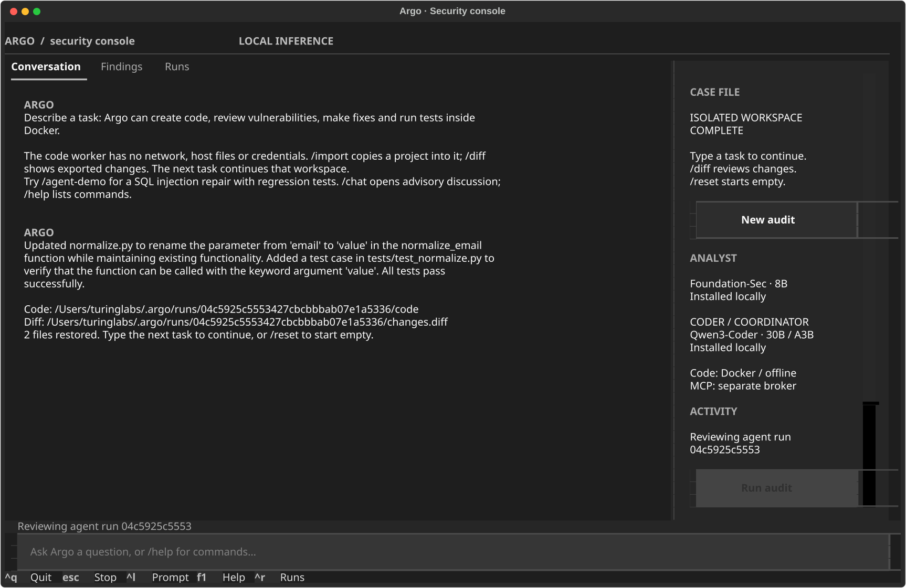

# Argo

A local cybersecurity agent that reviews vulnerabilities, creates code, applies fixes, and runs tests in an isolated Docker workspace.

Use natural-language tasks in the TUI or CLI. Qwen3-Coder coordinates tools and writes code; Foundation-Sec and VulnLLM provide specialist security reviews. Generated code has no network, host mounts, Docker socket, credentials, or host shell. A separate immutable broker connects to explicitly configured remote MCP tools. Source audits and bounded authorized web checks also remain available through the engagement workflow.

## Install

Requirements: Python 3.12+, `uv`, Docker, and native Ollama. Start Docker and Ollama before installing scanner images and models.

```bash
uv sync --frozen --dev
uv run python scripts/install_scanners.py
uv run python scripts/install_worker.py
uv run python scripts/install_models.py
uv run argo doctor
```

To install or resume only one model, use `uv run python scripts/install_models.py --model argo-coder:30b-a3b`. `--parallel N` controls 1–32 download connections; verified completed segments are retained between attempts.

Install the terminal command with the same dependency versions:

```bash
uv export --frozen --no-dev --no-emit-project --format requirements-txt --output-file /tmp/argo-constraints.txt >/dev/null
uv tool install --editable . --python 3.12 --constraints /tmp/argo-constraints.txt
```

The model installer downloads checksum-verified GGUF artifacts from pinned Hugging Face revisions and creates three local Ollama aliases:

| Alias | Model | Role |
| --- | --- | --- |
| `argo-foundation-sec:8b` | Foundation-Sec-8B-Reasoning, official Q4_K_M conversion | Security analysis and evidence review |
| `argo-vulnllm:7b` | VulnLLM-R-7B, community Q4_K_M conversion | Source vulnerability review |
| `argo-coder:30b-a3b` | Qwen3-Coder-30B-A3B-Instruct, Unsloth Q4_K_M conversion | Tool coordination, code generation and edits |

Model requests are sequential. The agent retains a model for up to five idle minutes; advisory audit/chat calls unload after generation. Configure Ollama with one loaded model and cloud mode disabled. Cloud model aliases are rejected. Exact weights, revisions, hashes, and provenance are in [models.lock.json](config/models.lock.json). Installation does not establish model accuracy on every language or vulnerability class.

## Create, test and repair code

```bash
argo agent 'Create a URL parser using the standard library, with pytest tests'
argo agent 'Audit this code, reproduce defects with tests, and fix them' --import /absolute/path/to/project
argo agent 'Add tests for malformed inputs' --continue RUN_ID
argo agent-demo
argo mcp-tools
```

Each task uses a new offline container. `/import` or `--import` copies sanitized source text; no project is mounted or modified in place. The agent writes and tests its copy. Code, `changes.diff`, tool evidence and reports are exported to a private `~/.argo/runs/RUN_ID/` directory, then the container is removed. Continuing a run verifies and copies its saved workspace into a fresh container. Python 3.12, its standard library, pytest and Bandit are installed; network package installation and host tools are unavailable.

The live SQL lab asks the models to create regression tests, reproduce an injection defect, edit the implementation and retest. A separate deterministic check verifies normal, missing, apostrophe and injection inputs against the generated code. Model-generated tests alone are not an independent security assessment.

See [the isolated-agent runtime](docs/isolated-agent.md) for tool contracts, MCP configuration, limits, and current boundaries.

## Terminal interface

Run `argo` to open the TUI, or `argo tui engagement.json` to load an existing case. All CLI subcommands remain available for scripts. Without a terminal, `argo` prints help.

The interface uses [Textual](https://github.com/Textualize/textual) under MIT. It shares Argo's Python controller and evidence store. The design draws on a terminal-first workflow; it is not a fork of Claude Code, Codex CLI, or OpenCode. [Toad](https://github.com/batrachianai/toad) is an alternative ACP frontend, and a possible future integration.



| Interaction | Command |
| --- | --- |
| Create or modify code in Docker | Type a task, or `/agent TASK` |
| Try the autonomous SQL repair lab | `/agent-demo` |
| Copy selected sources into the next workspace | `/import /absolute/path/to/project` |
| Start a fresh empty workspace | `/reset` |
| Read the generated code diff | `/diff` |
| View, disable or configure remote MCP access | `/mcp`, `/mcp off`, `/mcp /path/to/profile.json` |
| Discuss a finding without executing tools | `/chat QUESTION` |
| Create an engagement with a form | `/new` |
| Open an engagement | `/open /absolute/path/to/engagement.json` |
| Review targets, actions, and limits | `/scope` |
| Record authorization for the displayed contract | `/authorize` |
| Run the audit with both cyber models and Docker scanners | `/run` |
| Run the legacy loopback audit fixture | `/demo` |
| Inspect findings and select one as chat context | `/findings` |
| Open a selected finding's first evidence record | `/evidence` |
| Open a specific evidence record | `/evidence EVIDENCE_ID` |
| Review saved runs | `/runs`, then select a row and press Enter |
| Load a saved report | `/resume RUN_ID` |
| Read the full report | `/report` |
| Retest the loaded engagement against the selected run | `/retest` |
| Select the chat model | `/model foundation` or `/model vulnllm` |
| Cancel active work | Escape or `/stop` |

Plain text starts the isolated agent. Use `/chat` for advisory discussion of the current case or selected finding. Evidence is integrity-checked and redacted before entering model context. Tools are validated outside the model. Models differ in language support; Foundation-Sec's upstream model card lists English as its supported language.

Tab completes commands, up/down recall prompts, Ctrl+L focuses the input, Ctrl+R opens saved runs, F1 lists commands, and Ctrl+Q stops active work before closing. The sidebar hides on narrow terminals. Reports persist locally; advisory chat history stays in memory. `/resume` restores an agent workspace for a new task, or reopens a legacy audit report. It does not replay interrupted actions.

Use `/run --no-model` or `/demo --no-model` for explicit scanner-only operation. Add `--no-scanners` to use just the bundled static checks. `/doctor` reports service readiness. Full chat and audit validation details are recorded in [validation.md](docs/validation.md).

## Run the legacy audit demo from the CLI

```bash
uv run argo demo --scanners
```

The demo creates a temporary repository, synthetic advisory data, and vulnerable/fixed SQLite HTTP fixtures on loopback. It checks that only the vulnerable HTTP fixture produces a confirmed SQL injection result. Fixture servers and source snapshots are removed after the run; reports remain under `~/.argo/runs/`.

For a deterministic scanner-only test, explicitly use `--no-model`. A normal run requires its selected cyber models to be installed; there is no silent general-model or cloud fallback.

## Audit an authorized project

```bash
uv run argo init engagement.json --id my-audit --repo /absolute/path/to/project
uv run argo plan engagement.json
uv run argo authorize engagement.json --operator your-name --reference internal-audit-request
uv run argo run engagement.json --scanners
```

`authorize` records the operator's authorization for the exact normalized configuration, with a default four-hour expiry. It is not proof of ownership. Changing the scope, permitted actions, or limits invalidates it. Planning does not contact targets.

Add an explicitly authorized web origin with `--origin https://your-staging-host`. Add `--active-web` to include bounded CORS and Git HEAD exposure checks. Review the generated engagement before authorizing it. Discovered origins are never automatically added to scope.

```bash
uv run argo runs
uv run argo status RUN_ID
uv run argo report RUN_ID
uv run argo verify RUN_ID
uv run argo stop RUN_ID
uv run argo retest engagement.json --previous RUN_ID --scanners
```

Use `--state-dir /absolute/path` before the subcommand to change the evidence location. `verify` checks evidence hashes against the local manifest; it is not a signed attestation. Retest reports findings no longer detected without automatically claiming that they are fixed.

## Current capabilities

- Source snapshots with symlink/file-type/size checks and sensitive-file exclusions; no repository installation or hooks.
- Bundled Python/JavaScript checks, plus pinned Semgrep rules and Gitleaks in non-root, network-disabled Docker containers. Original source reaches Gitleaks through stdin; only redacted output is retained.
- Exact dependency inventory for npm lockfile v2/v3, pinned `requirements.txt`, and registry packages in `uv.lock`. Unsupported formats appear as coverage gaps.
- Cached offline intelligence and optional typed OSV, NVD, EPSS, and CISA KEV clients. Connected mode requires provider and disclosure permissions.
- HTTP requests restricted to authorized origins, with DNS/peer checks, route exclusions, redirect validation, request/time budgets, and selected response headers only.
- Bounded CORS checks and Git metadata exposure checks with negative controls. SQL injection validation is restricted to the explicit synthetic lab protocol.
- Evidence-linked local model analysis, SQLite state, redacted Markdown/JSON reports, integrity manifests, cancellation, and retest comparisons.

## Boundaries

General network scanning, authenticated business-logic testing, Nuclei/ZAP workers, cloud-account access, and automatic writes to original projects are not enabled. Generated Python and copied project tests execute in the offline code worker. This is a development sandbox, not a malware-analysis VM. Legacy engagement HTTP checks use the native broker; neither their network permissions nor their scanner adapters are exposed to the isolated agent.

External Streamable HTTP MCP access is implemented, with public DeepWiki enabled through a restricted repository-enum policy. `--no-mcp` disables it. Additional public MCP servers require an operator-supplied endpoint, tool allowlist and argument schemas. The separate `cve-mcp-server` sidecar remains disabled; [its contract](config/intelligence.contract.json) records that integration. Authenticated MCP, stdio servers and cloud model providers are not implemented. Do not put credentials in MCP profiles.

Static findings and model interpretations remain suspected. Confirmation requires deterministic validation and a negative control. Missing tools, stale intelligence, parse failures, or incomplete analysis appear in report coverage. Secret detection is pattern-based and does not guarantee detection of every credential format.

## Develop and verify

```bash
uv run ruff check src tests scripts
uv run python scripts/validate_design.py
uv run pytest -q
uv build
```

The complete suite includes real offline code workers, Docker scanners and loopback fixture servers. Use `uv run pytest -q -m 'not live'` when Docker is unavailable. Tests mock remote providers and model responses; live model and MCP validation is performed separately with `argo agent-demo` and `argo mcp-tools`.

- [Architecture](docs/architecture.md)
- [Research and original posts](docs/research.md)
- [Roadmap and remaining work](docs/roadmap.md)
- [Draft engagement example](config/engagement.example.json)
- [Engagement structural schema](schemas/engagement.schema.json)

Argo uses the MIT license. Models, scanner binaries/rules, and external services retain their upstream terms. Weights and scanner images are not included in the repository.
