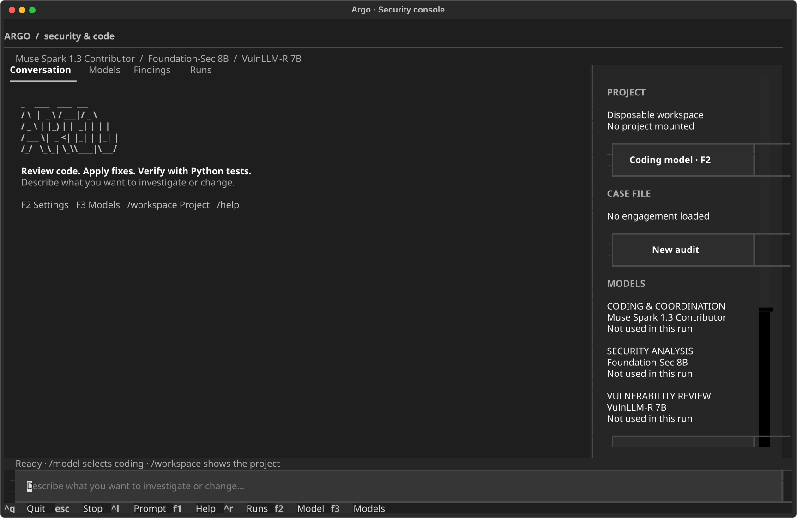
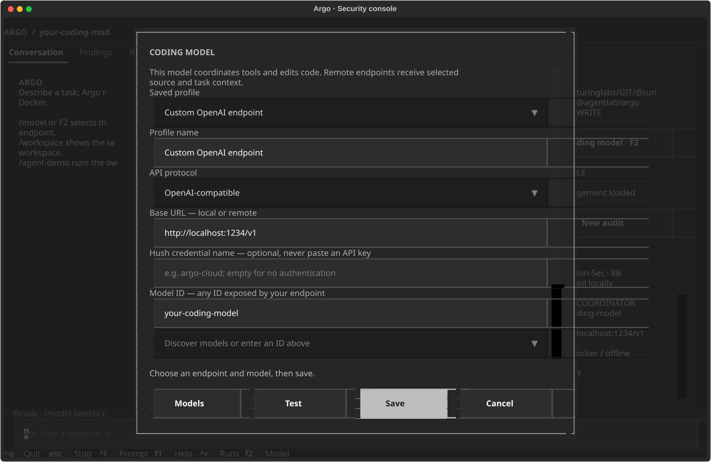

# Argo

Review code. Investigate security issues. Apply fixes and verify them.

Argo is a terminal agent with specialist local security models and your choice of local or remote coding endpoint. It edits the project you open and executes Python tests in Docker.

Launch Argo from a project directory: that directory is mounted read/write, and edits immediately change its files. F2 or /model selects any model ID through an Ollama, OpenAI-compatible or Anthropic-compatible endpoint. The selected model coordinates tools and writes code. Optional local Foundation-Sec and VulnLLM provide specialist reviews.

Code executes in a non-root, offline container with only the selected project mounted. Provider credentials, the Docker socket and other host directories are not mounted. Files inside the selected project are accessible to its code. A separate immutable broker connects to configured remote MCP tools.

## Install

Requirements: Python 3.12+, uv and Docker. Native Ollama is optional when using a remote coding endpoint.

    uv sync --frozen --dev
    uv run python scripts/install_worker.py
    uv run argo doctor

Install the terminal command with frozen dependency versions:

    uv export --frozen --no-dev --no-emit-project --format requirements-txt --output-file /tmp/argo-constraints.txt >/dev/null
    uv tool install --editable . --python 3.12 --constraints /tmp/argo-constraints.txt

For the optional local models, start Ollama and run:

    uv run python scripts/install_models.py

To install or resume only the coder:

    uv run python scripts/install_models.py --model argo-coder:30b-a3b

The installer verifies the pinned GGUF hashes. The --parallel option accepts 1–32 download connections. Local aliases are defaults, not an allowlist for coding:

| Alias | Model | Role |
| --- | --- | --- |
| argo-coder:30b-a3b | Qwen3-Coder-30B-A3B-Instruct, Unsloth Q4_K_M | Default coding and coordination |
| argo-foundation-sec:8b | Foundation-Sec-8B-Reasoning, official Q4_K_M | Optional security analysis |
| argo-vulnllm:7b | VulnLLM-R-7B, community Q4_K_M | Optional source review |

See [model provenance](config/models.lock.json). The legacy audit/chat commands retain local specialist adapters. Remote coding does not require the local models or a running Ollama service.

## Choose your coding model

Run argo, press **F2** or enter **/model**, then select or create a profile. The main form contains only the connection essentials; **Advanced** contains profile naming, response format and token overrides:

1. Choose Ollama, OpenAI-compatible or Anthropic-compatible.
2. Enter your base URL and model ID.
3. Optionally select a Hush credential by name.
4. Use Find models to discover IDs, or enter one manually.
5. Test checks structured output without sending project source. Save applies the profile to subsequent coding and coordination calls.

Profiles persist in ~/.argo/models.json and are also used by the CLI. Saving does not change the selected project.

OpenAI-compatible profiles use Chat Completions; Anthropic-compatible profiles use Messages. HTTP(S) hosts, custom ports, proxy prefixes and arbitrary model IDs are supported. URLs can end at the API root or the full generation path. OpenAI profiles offer prompt-only JSON, JSON object and JSON schema modes, plus max_tokens or max_completion_tokens. Unsupported capabilities produce visible errors; Argo does not silently switch providers.

OpenRouter was validated with base URL https://openrouter.ai/api/v1, model meta/muse-spark-1.3-contributor, JSON schema mode and max_tokens. The connection probe starts with 2,048 output tokens and can increase the allowance on truncation within the selected model budget. The [Contributor tier](https://openrouter.ai/meta/muse-spark-1.3-contributor) permits prompts and outputs to be used to improve Meta's products.

For authentication, install [Hush](https://github.com/turinglabsorg/hush), import the credential from Bitwarden with hush pull --name NAME, then enter only NAME in the form. Argo invokes hush run --redact and injects the key into a fixed provider process. API keys are never saved in model settings or sent to code workers. Leave the credential field empty for endpoints without authentication. Selecting a remote endpoint sends task context and selected source to it.

## Context and auto-compact

Argo reads the selected model's limits from its API, caches them for five minutes and refreshes them at the start of each task. OpenRouter reports **1,048,576 context tokens** and **943,718 maximum completion tokens** for Muse Spark 1.3 Contributor (verified September 7, 2026). The output ceiling uses the advertised maximum and remaining context. The initial allowance scales with prompt size and the model window, growing on truncation without replaying tools; there is no fixed 2,000-token coordinator ceiling. F2 allows optional context/output overrides; leave both blank for automatic limits.

Before each coordination request, Argo estimates token use from UTF-8 text and retains a 10% safety margin plus a response reserve. This is an estimate, not the provider's exact tokenizer count. At 90% of the input budget, auto-compact summarizes older history, retaining the original task, the deterministic completed-tool ledger and recent results. It saves a verified compaction record and context.json before the next action. Failed compaction does not discard history or replay tools. F3 shows the context limit, estimated use and compaction count.

Endpoints that do not publish context limits use an explicitly labelled 16,384-token fallback; set an override in F2 when the endpoint requires it. Local Ollama roles run with a 16,384-token context for memory usage. Large specialist reviews are split into source batches; cross-batch findings still require verification.

Reports, summaries and evidence persist. A new task currently starts a new conversation over the selected project or restored files; /resume reopens results, including local model responses, and does not replay actions or automatically load old conversation memory.

## Edit the project you open

    cd /path/to/project
    argo

Write a task directly in the TUI. The directory is mounted at /workspace, and code changes persist there, including when a later test fails or the task is cancelled. Argo checks whether selected files changed while the coding request was in flight before writing the response. Reports, code snapshots and changes.diff are also saved under ~/.argo/runs/RUN_ID/.

CLI equivalents:

    argo agent 'Fix this code and run the regression tests'
    argo agent 'Audit the code and apply fixes' --project /absolute/path/to/project
    argo agent 'Create a URL parser with pytest tests' --isolated
    argo agent 'Add regression tests' --continue RUN_ID

The default is the current directory. --isolated, --import and --continue use disposable workspaces instead. A saved snapshot cannot overwrite a mounted project. Home and filesystem root are rejected as project mounts.

Python changes require passing pytest before completion. Other text files can be edited, with missing runtime verification explicitly recorded. Python 3.12, pytest and Bandit are installed. Network package installation and non-Python runners are not available. See [runtime contracts and limits](docs/isolated-agent.md).

## Terminal controls

The TUI uses [Textual](https://github.com/Textualize/textual) under MIT.

| Interaction | Command |
| --- | --- |
| Create or change code | Type a task or /agent TASK |
| Select coding endpoint and model | F2 or /model |
| Show or change the mounted project | /workspace or /workspace PATH |
| Switch to a disposable workspace | /isolated |
| Copy sanitized sources into disposable mode | /import PATH |
| Reset context while retaining the selected project | /reset |
| Review changes already made | /diff |
| See all model roles and live analysis | F3 or /models |
| Configure remote MCP | /mcp, /mcp off, /mcp PROFILE.json |
| Discuss findings without execution | /chat QUESTION |
| Choose the separate advisory chat model | /model foundation or /model vulnllm |
| Saved runs and reports | /runs, /resume RUN_ID, /report |
| Inspect verified tool/finding evidence | /evidence or /evidence ID |
| Service readiness | /doctor |
| Stop active work | Escape or /stop |

Tab completes commands; up/down recall prompts. Ctrl+L focuses input, Ctrl+R opens runs, F1 shows help, and Ctrl+Q stops work before closing. The sidebar hides below 100 columns. All three models remain visible in the header; F3 opens their roles, activity and live responses. Local source reviews stream exposed reasoning separately from provisional analysis. Reasoning remains visible during the current session when the endpoint emits it; only validated final responses are saved as tool evidence. Foundation-Sec advertises native thinking; the installed VulnLLM endpoint currently does not. Findings appear during the run and remain available after reopening it. Older structured script/model observations are recovered from verified evidence and stay suspected.

Resuming a mounted-project report does not change the selected directory. Disposable runs restore verified files into a new disposable workspace. Report contents never grant permission to mount another path, and interrupted side effects are never replayed.

## External MCP

    argo mcp-tools

Public DeepWiki is enabled with a fixed repository-name enum. --no-mcp disables it. Additional public Streamable HTTP MCP servers need an operator-selected endpoint, tool allowlist and argument schemas, through --mcp-profile or /mcp. Calls run in a separate broker container with public DNS/IP checks and no project mount. MCP responses cannot change model, mount or permission settings.

Authenticated/stdio MCP is not implemented. Coding-provider authentication is separate and uses Hush. The [CVE MCP sidecar contract](config/intelligence.contract.json) remains disabled.

## Security labs and legacy audits

This owned SQLite lab asks the models to create a failing regression, apply a parameterized-query fix and rerun unchanged tests. A separate container checks positive, missing, apostrophe, injection and data-integrity cases. Model-generated tests alone are not independent security proof.

The legacy engagement workflow adds authorization binding, source/dependency inventory, isolated Semgrep/Gitleaks, typed vulnerability intelligence and bounded authorized HTTP checks:

    uv run python scripts/install_scanners.py
    argo demo --scanners
    argo init engagement.json --id my-audit --repo /absolute/path/to/project
    argo plan engagement.json
    argo authorize engagement.json --operator your-name --reference internal-audit-request
    argo run engagement.json --scanners

Add --origin to initialization for a selected staging origin and --active-web for bounded CORS/Git exposure checks. Authorization binds the exact normalized configuration and expires by default after four hours. It records the operator's authorization, not proof of ownership. Discoveries never expand scope automatically.

TUI /new, /open, /scope, /authorize, /run, /demo, /findings and /retest retain this workflow. CLI run/status/report/verify/stop/retest commands remain available. Add --state-dir before the subcommand to select another evidence directory.

## Boundaries and verification

The selected project is intentionally writable and visible to generated code. This is a development container, not a malware-analysis VM. General network scanning, authenticated business-logic testing, cloud-account access and Nuclei/ZAP workers are not enabled. Legacy HTTP checks use a separate scoped native broker.

Static and model findings remain suspected until deterministic validation. Secret redaction is pattern-based, and local evidence hashes are not signed attestations. The adapters accept compatible protocols, not every proprietary vendor extension. Models must follow the requested JSON/tool contract; availability and task quality remain endpoint-dependent.

    uv run ruff check src tests scripts
    uv run python scripts/validate_design.py
    uv run pytest -q
    uv build

Tests include real Docker workers/scanners, HTTP protocol fixtures, credential-process boundaries and TUI interaction. Actual model validation is separate and recorded in [validation.md](docs/validation.md). Use -m 'not live' when Docker is unavailable.

- [Architecture](docs/architecture.md)
- [Runtime and model settings](docs/isolated-agent.md)
- [Research and original posts](docs/research.md)
- [Roadmap](docs/roadmap.md)
- [Draft engagement example](config/engagement.example.json)
- [Engagement schema](schemas/engagement.schema.json)

Argo is MIT licensed. Models, scanners/rules and external services retain their upstream terms.
