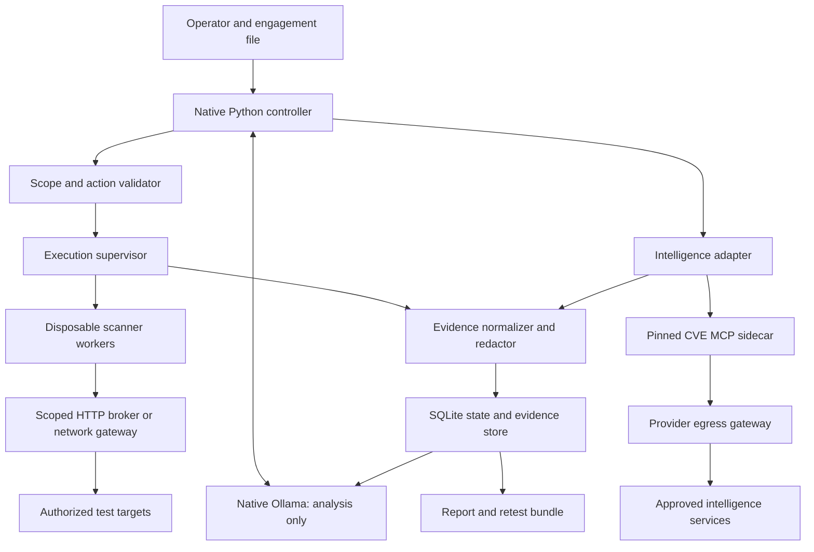

# Architecture

Status: proposed. This document defines the implementation contract, not a deployed system.

## Product boundary

Argo is an audit and pentest workstation agent. Its first targets are an explicitly selected local repository, an isolated lab application, and later an authorized staging web/API system. Continuous Mac monitoring, endpoint detection, cloud-account discovery, and production remediation are separate products or future engagements.

The useful output is a verified finding: affected asset, evidence, prerequisites, impact, reproduction, remediation, and retest. A scanner alert, model opinion, or matching CVE alone is a hypothesis.

## Components



The controller runs natively and calls Ollama on loopback. Scanner workers cannot contact Ollama, the controller, the Docker API, or arbitrary host services. The controller alone creates workers through the local Docker API. Model processes receive normalized evidence and emit typed proposals; they do not receive a shell or worker-management credentials.

Start with one controller and sequential model stages. Multiple specialist roles do not require independent concurrent agents. Use bounded concurrency only for independent scanner or intelligence work.

## Agent loop

`draft → authorized → inventory → hypotheses → validation → report → complete`

`paused`, `cancelled`, and `failed` are durable states. Network failures and unavailable tools must also appear in report coverage.

1. Parse an engagement, canonicalize targets, and validate authorization and budgets.
2. Snapshot approved source into a per-run workspace; inventory exact dependency versions, application entry points, and available test fixtures.
3. Run deterministic checks selected by the engagement profile.
4. Normalize findings and gather intelligence for known identifiers.
5. Ask the analyst for a bounded proposal: action type, existing asset ID, arguments, evidence references, expected observation, negative control, and stop condition.
6. Validate the proposal against the action schema, current scope, adapter capabilities, remaining budgets, and prior observations. Reject unknown fields and tool names.
7. Execute through a reviewed adapter. Record tool/rule versions, inputs, scope digest, timestamps, exit status, and redacted output.
8. Compare observations with the hypothesis; classify it as suspected, confirmed, rejected, or inconclusive.
9. Stop on completion, expiry, cancellation, action/request budget exhaustion, or repeated non-progress. Persist resumable state without replaying actions that may have side effects.

Malformed model output receives at most two repair attempts. Repeated invalid proposals pause the model stage. A missing model cannot silently turn a scanner-only run into an AI-verified result.

## Engagement and authorization

An engagement declares exact repository roots, web origins, optional network ranges and ports, excluded routes, test classes, data-sharing permissions, limits, and credential references. The operator authorizes the normalized scope once. The controller stores a digest of the execution-relevant specification, identity/reference, and expiration. A changed target, permitted action, credential binding, or disclosure policy invalidates that authorization.

The configuration is a record of authorization supplied by the operator, not evidence of ownership by itself. The agent must not infer new targets from existing cloud credentials, local repository lists, hyperlinks, subdomains, certificates, or the user's general workstation configuration.

Actions already covered by the engagement proceed without repeated confirmation. Scope expansion and test classes outside that authorization produce a concrete amendment for review. The MVP has no destructive-test, credential-spraying, persistence, lateral-movement, or production-write adapter.

## Scope enforcement

Enforce scope before scheduling, immediately before execution, and at the actual network/file boundary. A prompt or JSON Schema alone cannot enforce it.

- Resolve repository paths and verify containment. Snapshot an allowlisted file set; exclude `.git`, secret files, sockets, device nodes, dependencies, and paths escaping through symlinks. Do not execute repository hooks or install scripts during inspection. Test execution uses a separate lab snapshot.
- Canonicalize HTTP origins using a URL parser: scheme, IDNA hostname, and effective port. Reject credentials in URLs, ambiguous numeric hosts, wildcard origins, unsupported schemes, and unrecognized encodings. Validate decoded/normalized paths against exclusions.
- Revalidate redirects and discovered links. Discovery never grants permission. Pin approved DNS answers at connection time, retain the original hostname for TLS/SNI, and verify the peer address. Mixed approved/unapproved resolutions fail closed.
- Web-origin authorization permits HTTP requests to that origin only. It does not authorize scanning its CDN/shared IP or neighboring virtual hosts. Network scans require independently declared address ranges and ports.
- Private and loopback targets are permitted only by an explicit local/staging scope and a dedicated route. Block metadata endpoints, the Docker socket, model endpoints, and other host management services. A local target must use a specific relay; do not expose the whole host to workers.

HTTP workers use an internal Docker network with no direct Internet route and an enforced HTTP broker. A configured proxy environment variable is insufficient. The broker validates every request, including redirects, destination address, method, route, and credential binding. HTTPS path restrictions require a broker that can inspect HTTP traffic; unrestricted CONNECT tunnels cannot enforce them. If a scanner cannot use this boundary, it remains disabled until an equivalent enforcement path is tested.

Network-scanner workers use a separately provisioned gateway/firewall for approved IPs and ports. They cannot bypass that gateway. The worker itself never receives `NET_ADMIN`. Do not enable remote network scanning before packet-level integration tests prove the boundary on Docker Desktop.

## Worker isolation and budgets

Use pinned ARM64 images, non-root users, a read-only root filesystem, dropped capabilities, `no-new-privileges`, process/memory/CPU limits, bounded output, and a per-run writable scratch volume. Keep the default Docker seccomp profile; verify each tool under it. Never mount the host home, cloud configuration, SSH agent, Hush vault, or Docker socket.

Set initial per-engagement defaults to two tool workers, one loaded model, 30 model actions, 300 seconds per tool, 2 requests/second per target, and 500 total target requests. These are proposed operating limits, adjustable within the authorized engagement. Enforce aggregate counts at the broker, including retries and redirects; tool flags alone are not sufficient. Cap evidence at 250 MiB per run and model input per item at 32 KiB after normalization. Truncation must be visible.

Cancellation revokes the network lease and stops all job processes/containers before returning. Persist partial evidence and a cancelled status. A crash must not leave a scanner with an indefinite route. Use supervisor leases, finite container/tool deadlines, and startup cleanup scoped to Argo-owned job IDs.

Docker isolation is appropriate for reviewed scanner binaries and controlled fixtures. Execution of downloaded PoCs or untrusted malware is outside the initial design and would need a dedicated disposable VM and separate workflow.

## Initial adapter set

| Adapter | Purpose | Execution/data policy | Milestone |
| --- | --- | --- | --- |
| Repository inventory | Exact lockfile versions, source map, app entry points | Read-only snapshot, no install scripts | M1 |
| Semgrep | Rule-based source findings | Local pinned rules; network disabled | M1 |
| Gitleaks | Secret exposure findings | Full secret redaction before persistence/model input; never use discovered credentials | M1 |
| Dependency inventory + OSV | Exact package/version vulnerability matching | Cached records offline; minimal approved package tuples online | M2 |
| CVE MCP adapter | CVE, EPSS, KEV enrichment | Approved providers and typed identifiers only | M2 |
| HTTP/TLS inspection | Headers, certificates, redirects, exposed metadata | Scoped broker, bounded requests | M3 |
| Curated Nuclei | Reviewed, non-destructive vulnerability checks | Pinned template hashes; no automatic update, code execution, headless, fuzzing, or OAST templates | M3 |
| ZAP baseline | Crawl and passive analysis | Crawling still contacts targets; route/method restrictions and request budget apply | M3 |
| Nmap connect profile | Approved TCP service discovery | Explicit IP/port scope; no broad scripts or unrestricted options | M4 |
| Controlled validation | Reproduce a specific finding or authorization flaw | Lab fixtures/test accounts, negative controls, minimal data access | M3–M4 |

Adapter names here are Argo design concepts, not commands implemented today. Check tool licensing, ARM64 availability, telemetry defaults, arguments, and exit semantics when integrating. Store raw scanner output locally before normalization only if it is already redacted; secrets must not appear in the model context or report.

Business-logic/API testing needs more than scanners: operator-provided API schemas, distinct test roles, seeded objects, an authorization matrix, and specific allowed actions. Confirm an access-control defect using a fixture/test object and a correct denial control. Report missing account coverage explicitly.

## Local inference

Use native Ollama for Apple Metal acceleration. Keep the initial model context at 8K tokens, load one model at a time, and measure memory pressure and latency on this machine. Larger context is an evaluated configuration change, not an assumed benefit.

Foundation-Sec-8B-Reasoning is the first analyst candidate; VulnLLM-R-7B is a source-review specialist. Compare them against one general instruct/coding baseline with known structured-output behavior. A 14B–32B baseline is an optional later experiment, not an MVP requirement. CyberSecQwen-4B is a possible lightweight CTI classifier. SecAlign is an optional research comparison for hostile-input handling, not the authorization layer.

Do not assume Hugging Face weights are directly runnable in Ollama. Before selecting any artifact, pin its source revision, file hash, quantization, chat template, license reference, context setting, and conversion provenance. Validate extraction of final answers for reasoning models. Test structured action proposals separately from cybersecurity question answering. No model download or local inference benchmark has been performed for this design.

Retrieved code, HTML, scanner output, and MCP responses are untrusted data. Keep instructions and evidence separate, limit response sizes, remove executable formatting from reports, and validate every proposed action independently. A second model or prompt-injection classifier may add a signal but never grants permissions.

## Intelligence integration

Use the inspected upstream revision in `config/intelligence.contract.json` as a review baseline. The sidecar is not installed yet. The integration must validate its actual MCP tool list and schemas, because the inspected README and Python signatures disagree.

Start with `lookup_cve`, `get_epss_score`, and `check_kev`. Add `triage_cve` only with the adapter fixing `depth="quick"` and after its transitive provider calls are mapped. Preserve structured source records through dedicated adapters where text output cannot represent missing-data status reliably.

Upstream startup performs network work, and composite calls may invoke additional providers. Egress rules must cover the transitive call graph; permitting one tool name is not enough. Run the sidecar with an isolated working directory and clean environment, without project `.env` discovery. Use isolated cache/audit paths and an audited locked dependency environment.

Two explicit modes:

- **Offline:** local inference, source inspection, and previously recorded intelligence. Do not start the online sidecar. Every intelligence record includes source date, retrieval date, and stale/missing status.
- **Connected:** local inference plus outbound calls to approved intelligence providers. CVE IDs and, when enabled, public package/version tuples may leave the machine. Private package names, domains, IPs, code, credentials, logs, and URLs require separate disclosure permissions.

Shodan/VirusTotal/GreyNoise/domain intelligence is optional and disabled initially. There are no automatic file uploads, public URL submissions, or broad GitHub secret searches. Hush injects only the required named credential into the appropriate sidecar or scoped credential broker; model-facing configuration contains references only. Require Hush output redaction and independently redact files/artifacts, since stdout filtering does not sanitize written files.

## Evidence, prioritization, and reporting

Each finding contains a stable ID; asset and location; category/CWE; status; impact and confidence; evidence IDs; affected-version evidence; assumptions; reproduction and negative control; remediation; and retest outcome. Optional CVE records include source links and retrieval timestamps. Keep `unknown`, `unavailable`, `stale`, and `not applicable` distinct from a negative result.

Prioritize with separate fields for observed reachability, validated impact, affected version, CVSS, EPSS/date, and KEV status. A high upstream composite score does not prove the target is vulnerable. Record the upstream score as a source assertion; calculate local urgency only after assessing applicability. A code flaw without a CVE can still be high priority.

Evidence manifests record SHA-256 hashes, scope digest, source snapshot hash, scanner/rule/model identifiers, timestamps, redaction status, and execution IDs. Hashes help detect changes but do not make a same-user writable store tamper-proof. Default to redacted evidence; retaining sensitive raw evidence requires an explicit encrypted-storage workflow. Use restrictive file permissions and local retention controls.

Persist normalized records in SQLite and bounded evidence files under `~/.argo/engagements/<id>/`. Never commit engagement state or reports to the source repository. Initial output formats are Markdown and JSON; SARIF can follow for source findings. Include coverage gaps and failed checks. Do not automatically post findings to external systems or apply fixes.

## Reuse inside AgentLab

- **Bowie:** reuse the task lifecycle and MCP adapter concepts. Its current generic shell tool, mutable task cache, and Docker configuration do not provide Argo's scope enforcement. Do not adopt its runtime unchanged.
- **Hush:** use its existing named-secret workflow instead of inventing another vault.
- **Mcaifee (`prot/`):** optional supply-chain signal for JavaScript dependencies; it complements vulnerability matching.
- **GemmaCode:** its Ollama integration is a useful local serving reference. An existing tool template or model alias does not establish reliable tool use for a different model.

## Proposed source layout

```text
src/argo/
  cli.py             engagement lifecycle and operator commands
  controller.py      state machine and bounded planning loop
  contracts.py       typed actions, findings, and evidence records
  scope.py           canonicalization and authorization binding
  supervisor.py      worker lifecycle and cancellation
  inference.py       local structured-output adapter
  intelligence/      restricted MCP and typed provider adapters
  scanners/          reviewed executables and output normalizers
  evidence.py        redaction, manifests, and persistence
  report.py          Markdown/JSON reporting and retest comparisons
sandbox/             worker builds, HTTP broker, network policies
tests/integration/   fixture services, tools, providers, and boundary tests
evals/               model corpus and scoring harness
```

These directories describe future implementation; empty modules are intentionally not presented as working software.
